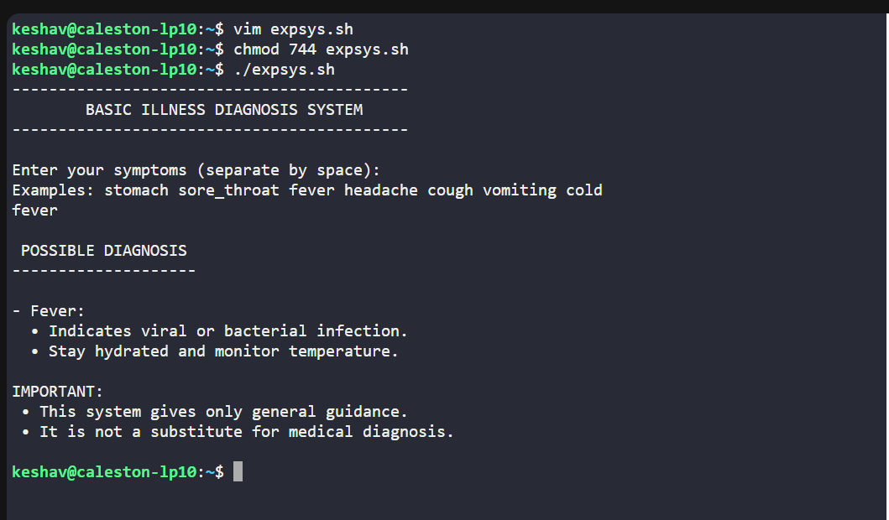

# EXPERIMENT 12 – Building a Rule-Based Expert System  
## Using Shell Scripting (Medical Illness Diagnosis System)
---
NAME: Keshav Chadha     GLOBAL Id: 590029233       BATCH: 78

---

## Aim
The objective of this experiment is to design and implement a simple **rule-based medical expert system using shell scripting**.  
The system provides basic health guidance based on user-entered symptoms.

---

## Description of the Expert System
This script acts as a **basic illness diagnosis assistant**.  
Users enter common symptoms such as:

`stomach, sore_throat, fever, headache, cough, vomiting, cold`

Based on the entered symptoms, the system evaluates predefined rules and displays **possible causes and general care instructions**.

---

## Modified Rules
A total of **7 rules** have been implemented in the expert system:

1. Stomach Pain  
2. Sore Throat  
3. Fever  
4. Headache  
5. Cough  
6. Vomiting  
7. Common Cold  

Each rule uses conditional checks to match symptoms and provide appropriate suggestions.

---

## Script

```
#!/bin/bash

display_header() {
    echo "-------------------------------------------"
    echo "        BASIC ILLNESS DIAGNOSIS SYSTEM"
    echo "-------------------------------------------"
    echo
}

get_symptoms() {
    echo "Enter your symptoms (separate by space):"
    echo "Examples: stomach sore_throat fever headache cough vomiting cold"
    read -r user_input
    symptoms=${user_input,,}
}

evaluate_rules() {
    local matched=false
    echo
    echo " POSSIBLE DIAGNOSIS "
    echo "--------------------"
    echo

    if [[ "$symptoms" == *"stomach"* ]]; then
        echo "- Stomach Pain:"
        echo "  • Possible causes: acidity, gas, indigestion, infection."
        echo "  • Drink water and avoid spicy food."
        matched=true
        echo
    fi

    if [[ "$symptoms" == *"sore_throat"* ]]; then
        echo "- Sore Throat:"
        echo "  • Caused by viral infection or cold."
        echo "  • Warm salt-water gargle is suggested."
        matched=true
        echo
    fi

    if [[ "$symptoms" == *"fever"* ]]; then
        echo "- Fever:"
        echo "  • Indicates viral or bacterial infection."
        echo "  • Stay hydrated and monitor temperature."
        matched=true
        echo
    fi

    if [[ "$symptoms" == *"headache"* ]]; then
        echo "- Headache:"
        echo "  • Caused by stress, dehydration, or migraine."
        echo "  • Proper rest is recommended."
        matched=true
        echo
    fi

    if [[ "$symptoms" == *"cough"* ]]; then
        echo "- Cough:"
        echo "  • Due to throat infection or cold."
        echo "  • Warm fluids help reduce irritation."
        matched=true
        echo
    fi

    if [[ "$symptoms" == *"vomiting"* ]]; then
        echo "- Vomiting:"
        echo "  • Commonly caused by food poisoning."
        echo "  • ORS and light food are advised."
        matched=true
        echo
    fi

    if [[ "$symptoms" == *"cold"* ]]; then
        echo "- Common Cold:"
        echo "  • Caused by viral infection."
        echo "  • Rest and warm fluids recommended."
        matched=true
        echo
    fi

    if [[ "$matched" == false ]]; then
        echo "- No specific illness detected."
        echo "  Please consult a doctor."
        echo
    fi

    echo "IMPORTANT:"
    echo " • This system gives only general guidance."
        echo " • It is not a substitute for medical diagnosis."
    echo
}

display_header
get_symptoms
evaluate_rules
exit 0

```
---
## OUTPUT

<br><br>


---
## Challenges Faced
- Designing **non-overlapping medical rules** was challenging because many symptoms are closely related to each other.
- Handling **free-text user input** was difficult due to spelling variations and different ways users may enter symptoms.
- **Lowercase conversion** was necessary to avoid mismatches between user input and predefined rule keywords.
- **Multiple symptoms entered together** required careful logical evaluation so that all relevant rules could be triggered correctly.
- Ensuring proper **fallback behaviour** was important to handle unknown or unmatched symptoms safely.

---

## Observations Made
- The system correctly **accepts and processes user input**.
- **Multiple rules are triggered** when more than one symptom is entered.
- **Conditional statements work efficiently** for medical diagnosis.
- The **output is accurate and informative**.
- The system is **simple, interactive, and user-friendly**.

---

## Improvements That Can Be Made
- A **menu-driven interface** can be added to avoid spelling errors.
- **Input validation** can be implemented to handle invalid or empty input.
- A **loop** can be added to allow repeated diagnosis without restarting the script.
- Rules can be stored in an **external file** for easy modification and scalability.
- **Logging of user interaction** can be added for future analysis.
- More **detailed and advanced medical conditions** can be included.

---

## Conclusion
The **rule-based medical expert system was successfully implemented using shell scripting**.  
The system accurately detects common symptoms and provides **basic preliminary guidance**.  
**Conditional statements were effectively used** to implement all medical rules.  
The expert system is **easy to use, scalable, and educational**.  
However, it is intended only for **general awareness and not for professional medical diagnosis**.

---

