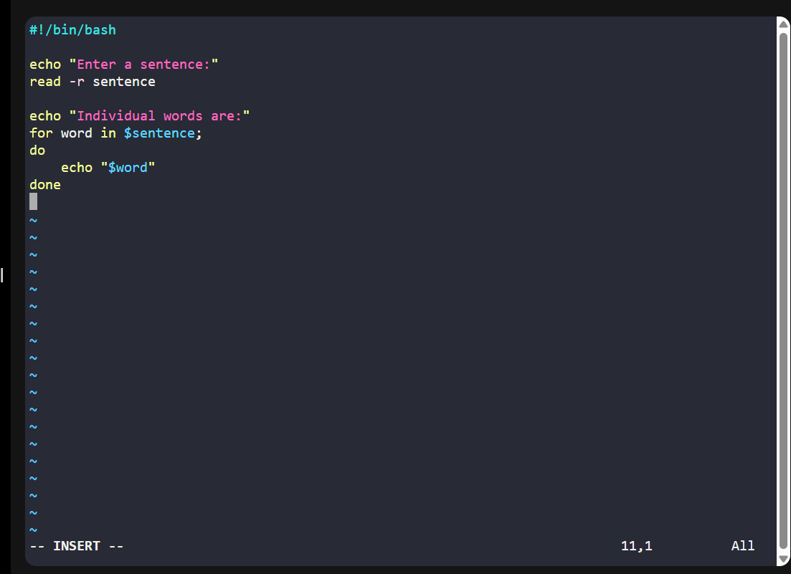
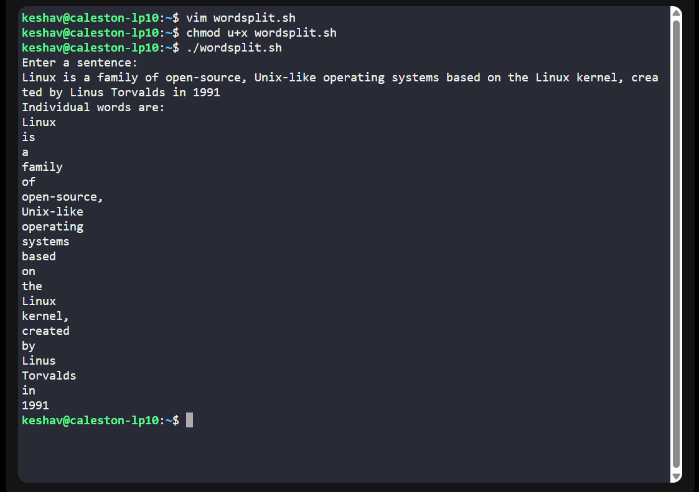
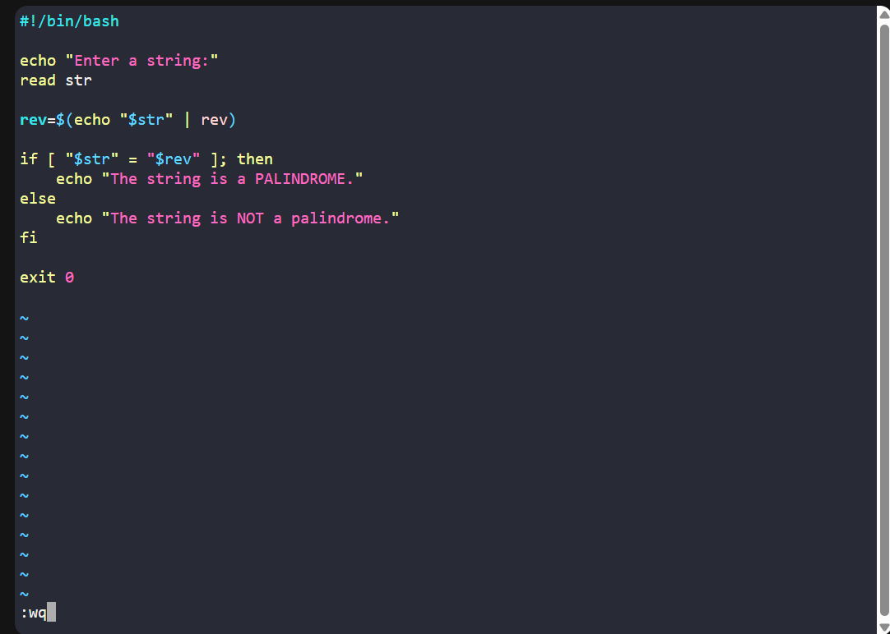
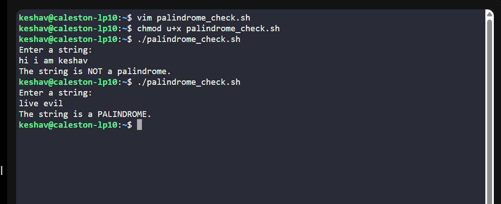

# <h1 style="background-color: orange;"> EXPERIMENT 11 - Shell Programming</h1>
---------------------------------------------------------------------------
Name: Keshav Chadha   SAP id:590029233    Batch: 78

---------------------------------------------------------------------------
#### Github link for this experiment: [EXP11](https://github.com/keshav-2828/Linux_EXP__11__12)

---------------------------------------------------------------------------
##  Aim
   To learn the fundamentals of Shell Scripting in Linux

---------------------------------------------------------------------------
## Tools & Software Used 
- **Operating System:** Ubuntu running on Oracle VirtualBox  
- **Terminal Emulator:** GNOME Terminal 
- **Shell:** Bash (*Bourne-Again Shell*)

---------------------------------------------------------------------------
## Theory 
- Interacting with Users: Interactive shell scripts
- Parsing and Processing Data Formats 
- Interacting with Databases

---------------------------------------------------------------------------
## <h1 style="background-color: pink;">TASK 1: String's Words Split</h1>
 **Write a script that takes a sentence as input and splits it into individual words.**  

  ### Script:
     

  ### Output:
     

---------------------------------------------------------------------------
## <h1 style="background-color: pink;">TASK 2: String Palindrome Check</h1>
  **Create a script that checks whether a given string is a palindrome or not.**   

  ### Script:
     

  ### Output:
     

---------------------------------------------------------------------------
## <h1 style="background-color: pink;"> OBSERVATION</h1> 
- Both scripts successfully accept input from the user using the read command.
- The word split script correctly separates a sentence into individual words using a for loop.
- The palindrome script correctly reverses the input string using the rev command.
- Conditional statements (if-else) work properly to produce correct decisions in both scripts.

---------------------------------------------------------------------------
## <h1 style="background-color: pink;"> CONCLUSION</h1> 

- The word splitting and palindrome checking scripts were successfully implemented using basic shell scripting commands. 

----------------------------------------------------------------------------